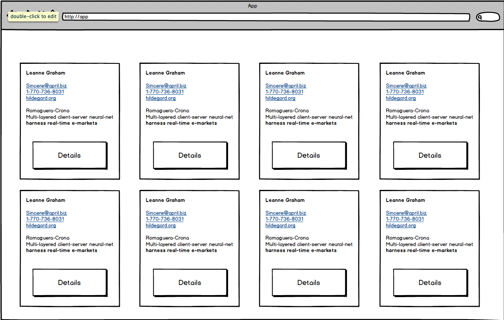
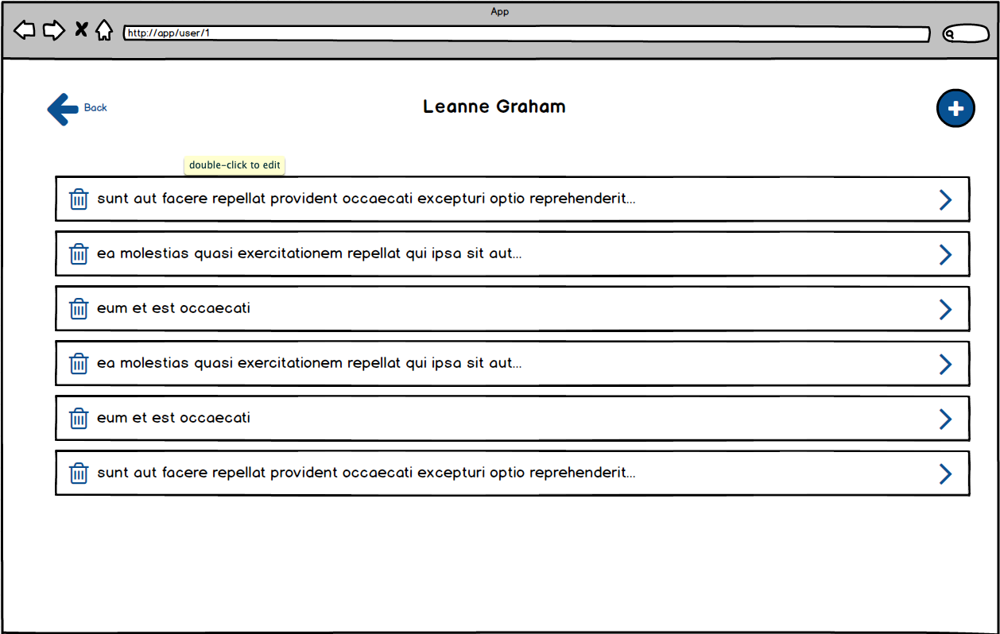
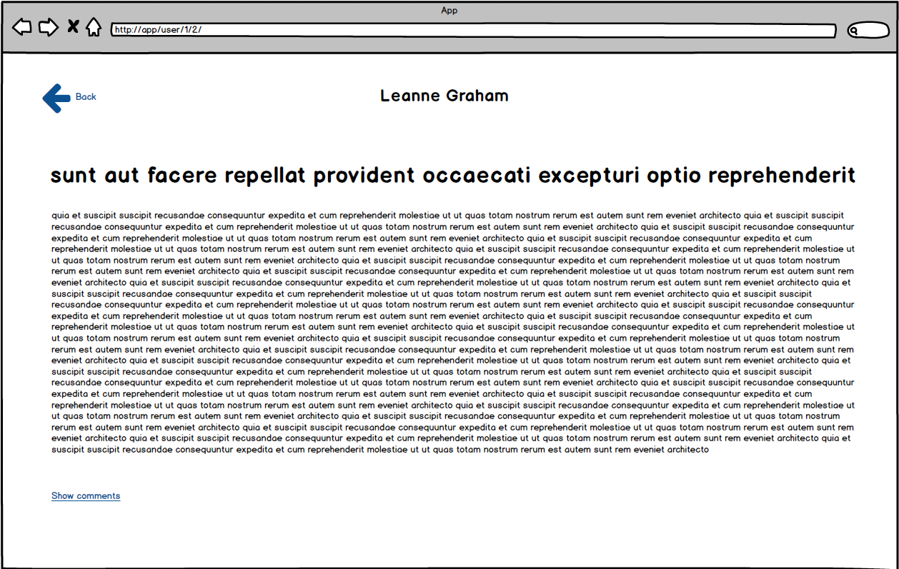
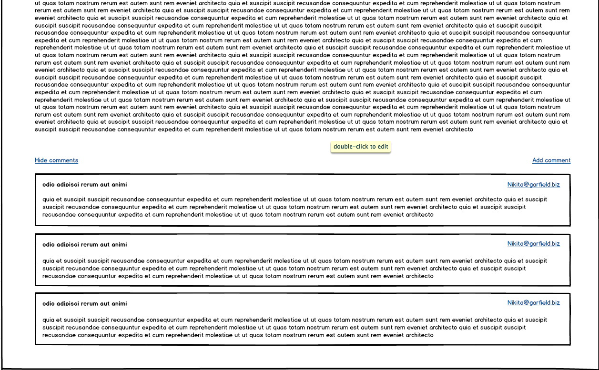
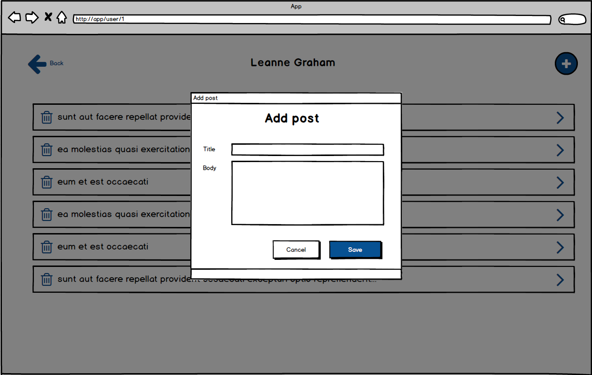
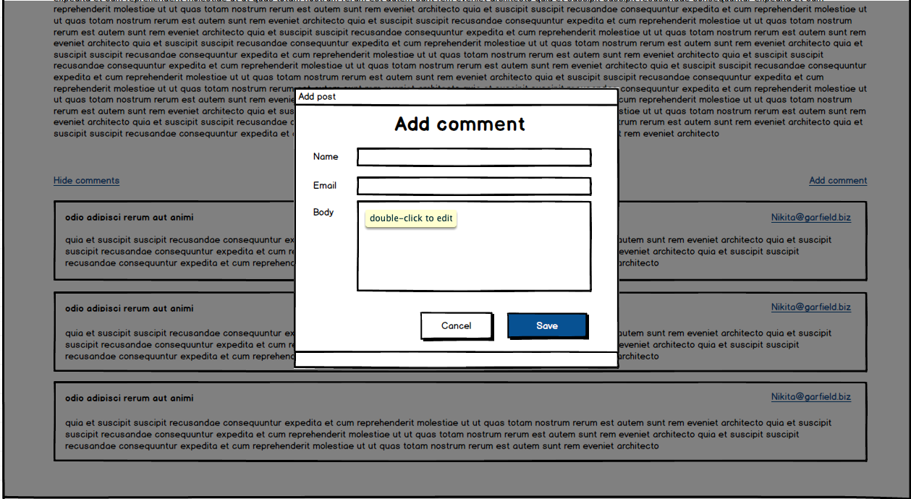

# React Native Developer Recruitment Task

## Description

Your job is to code an app with posts of users with ability to manage posts and comments.
Application should be created with Expo and got multiple screens (listed below).

## Tech stack:

- API: [API DOCS](https://jsonplaceholder.typicode.com/)
- Starter: [Expo](https://docs.expo.io/) - TS template
- Routing: [React-navigation](https://reactnavigation.org/docs/getting-started)
- Typescript: [DOCS](https://www.typescriptlang.org/docs/handbook/intro.html)

## Screens:

- `Sign In`
  
  - Form with 2 fields (email, password)
  - After fill form user should post it on /users endpoint (email, password)
  - If response is ok, should get response and save it to secure store - next time user have not fill form again - can login by biometric or code with stored data
    
  - Sign in screen by biometric tools
- `Homepage`
  
  - There are 2 tabs - users and posts
  - There is a hamburger icon on top bar which can open a drawer.
  - Drawer should contain logged user name and button to logout.
- `Homepage - Users List Tab`
  
  - List of users.
  - For each user you must display his user name.
  - On user click you will redirect to `User Details` page
- `User Details`
  
  - This page contains the user name at top navigation bar.
  - List of user posts (just titles trimmed to one line).
  - On click on the post item you will redirect to `Post Details` page
  - Action Button that on click will open the `Add post modal`.
  - Close cross button will go back to `Homepage - User List Tab`
- `Post Details`
  
  
  - On top you still have the username
  - Post full details
  - Button to remove post.
  - On remove you will have to go back to `User Details` page and remove current post from the list and API.
  - Button/link for comments 'show/hide comments' that will toggle the comments list visibility.
  - Button to add comment.
  - Adding comments should be similar to `Add Post Modal` but contain different fields and action.
  - Back button that will go back to `Posts list
- `Add Post/Comment Modal`
  
  
  - Title
  - Form fields
  - Two buttons `Cancel`, `Save`
  - Cancel will just close the modal and ignore changes
  - Save will connect with API and add Comment/Post to the list

## Must-have:

1. React + Typescript
2. Connection with API (GQL)
3. Usage of react-router for multiple pages
4. Loaders when you wait for the data (react-skeleton)
5. Validation on forms
6. Usage of modern js functionality (ES6+)

## Good to have:

1. Clean code (linters, prettier)
2. UI kit for styles (or styled-components)
3. Tests
4. App deployed to [Netlify](https://www.netlify.com/)

## What will we be paying attention to:

1. How you split code for components
2. How your manage your data.
3. Reusability of the components.
4. Code repetitions and reusability (keep your code [DRY](https://en.wikipedia.org/wiki/Don%27t_repeat_yourself) and simple [KISS](https://en.wikipedia.org/wiki/KISS_principle)).
5. How and where you put your business logic.
6. Code optimization and the solution&#39;s performance.
7. Working in accordance with good practices in general.
8. How you communicate with API.
9. Handling unexpected errors or potential exceptions.
