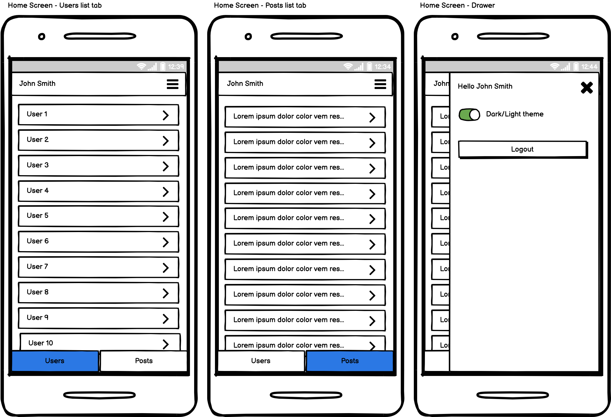
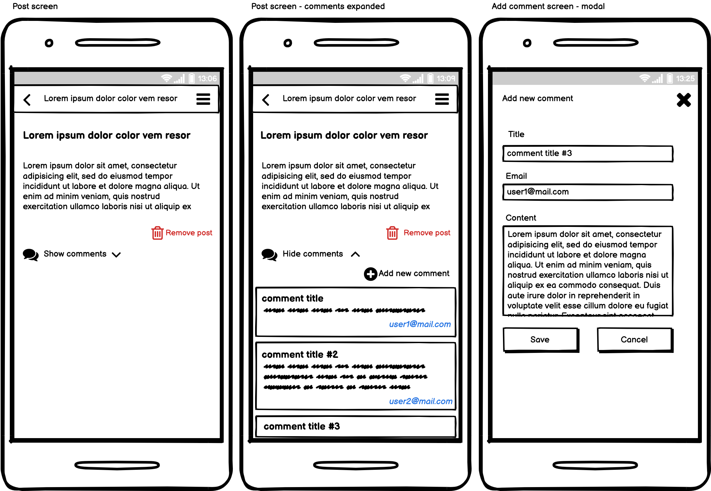

# React Native Developer Recruitment Task

## Description

Your job is to code an app with posts of users with ability to manage posts and comments.
Application should be created with Expo and got multiple screens (listed below).

## Tech stack:

- API: [API DOCS](https://jsonplaceholder.typicode.com/)
- Starter: [Expo](https://docs.expo.io/) - TS template
- Routing: [React-navigation](https://reactnavigation.org/docs/getting-started)
- Typescript: [DOCS](https://www.typescriptlang.org/docs/handbook/intro.html)

## Screens:

- `Sign In`
  - Form with 2 fields (email, password)
  - After fill form, user should post it on /users endpoint (email, password)
  - If response is ok, should get response and save it to secure store - next time user have not fill form again - can login by biometric or code with stored data
- `Sign In - Biometric`
  - Sign in by biometric tools
    
- `Home Screen`
  - There are 2 tabs - users and posts
- `Home Screen - Users List Tab`
  - List of users.
  - For each user you must display his user name.
  - On user click you will redirect to `User Details` page
- `Home Screen - Posts List Tab`
  - List of posts.
  - For each posts you must display titles (just titles trimmed to one line).
  - On user click you will redirect to `Post Details` screen.
- `Home Screen - Drawer`
  - There is a hamburger icon on top bar which can open a drawer.
  - Drawer should contain logged user name, toggle to change theme and logout button.
  - toggle change colors light/dark (change styled component theme)
  - After logout should clear secure store - back to the standard sign in screen
    
- `User Screen`
  - This page contains the user name at top navigation bar.
  - List of user posts (just titles trimmed to one line).
  - On click on the post item you will redirect to `Post Details` screen.
  - Action Button that on click will open the `Add post modal screen`.
  - Back button will go back to `Homepage - User List Tab`
- `Add Post Modal`
  - Form fields: Title, Content
  - Validation - title required field, title more than 3 characters
  - Two buttons `Save`, `Cancel`
  - Cancel will just close the modal and ignore changes
  - Save will connect with API and add Post to the list
    
- `Post Details`
  - On top you still have the post title
  - Post full details
  - Button to remove post.
  - On remove you will have to go back to `User Details` or `Posts List` (depends where you were before) screen and remove current post from the list and API.
  - Button/link for comments 'show/hide comments' that will toggle the comments list visibility.
  - Button to add comment.
  - Adding comments should be modal screen similar to `Add Post Modal` screen but contain different fields and action.
  - Close button that will go back to `Post Details` screen
- `Add Comment Modal`
  - Form fields: Title, Email, Content
  - Validation - All fields required, title more than 3 characters, email - email validation
  - Two buttons `Save`, `Cancel`
  - Cancel will just close the modal and ignore changes
  - Save will connect with API and add Comment to the list
    

## Must-have:

1. React Native + Typescript
2. Connection with API - REST (can use reqct-query)
3. Usage of react-navigation for multiple screens
4. Loaders when you wait for the data (can be standard from React Native)
5. Static validation on forms
6. Usage of modern js functionality (ES6+)

## Good to have:

1. Clean code (linters, prettier)
2. UI kit for styles (or styled-components)
3. Tests

## What will we be paying attention to:

1. How you split code for components
2. How your manage your data.
3. Reusability of the components.
4. Code repetitions and reusability (keep your code [DRY](https://en.wikipedia.org/wiki/Don%27t_repeat_yourself) and simple [KISS](https://en.wikipedia.org/wiki/KISS_principle)).
5. How and where you put your business logic.
6. Code optimization and the solution&#39;s performance.
7. Working in accordance with good practices in general.
8. How you communicate with API.
9. Handling unexpected errors or potential exceptions.
